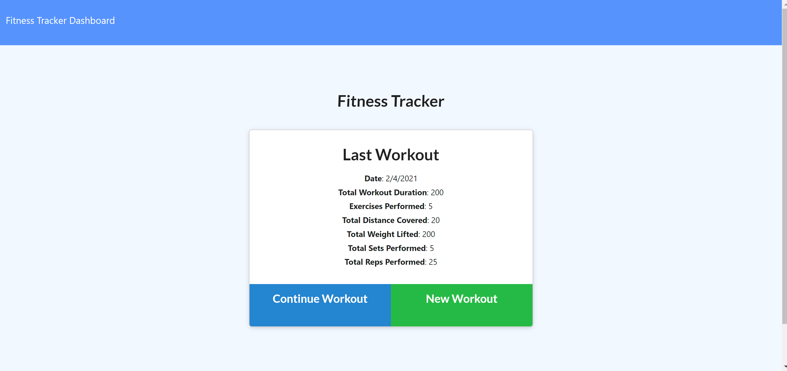
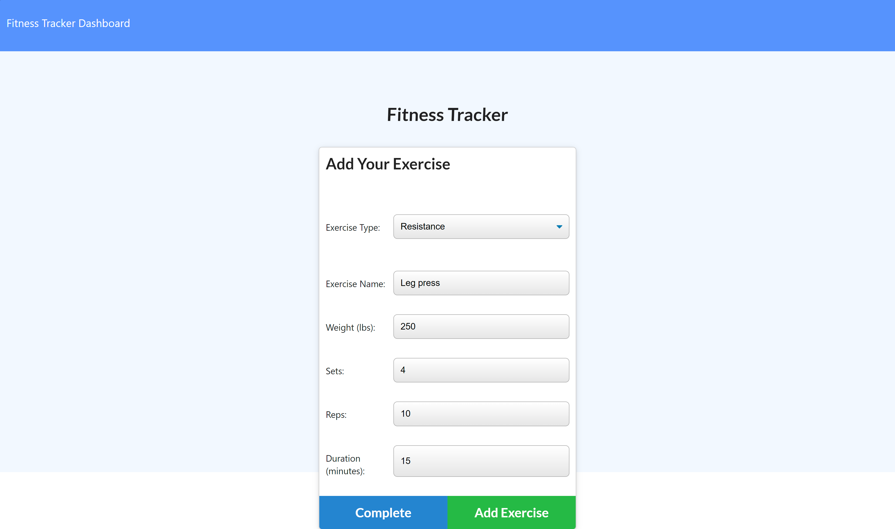
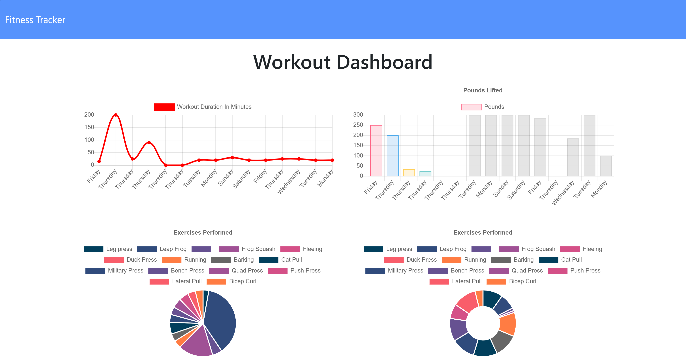

# Exercise Watcher

# Project Name: Exercise Watcher

## Description

A workout application that tracks your daily exercises and give you visual feedback on your daily workout plan.

## Table of Contents

1. [Installation](#installation)

2. [Usage](#usage)

3. [License](#license)

4. [Screenshots](#screenshots)

5. [Technology](#technology)

6. [Questions](#questions)

## Installation

Open link to the app and choose a new Workout, or continue using the most recent workout. Input exercises, choosing between cardio or resistance. Records for the week are available in the stats page.

## Usage

Free to use

## License

Licensed under: MIT license

## Screenshots

## Technology used

`Javascript, HTML, CSS, NodeJS, Express, MongoDB, Mongoose `

## Questions

GitHub Repository:

http://github.com/SamFan808/

For any questions, please contact me at none
